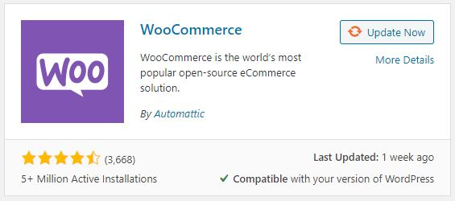
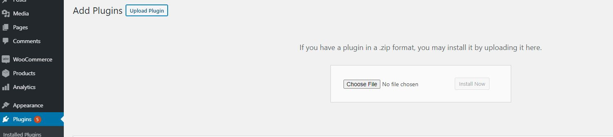
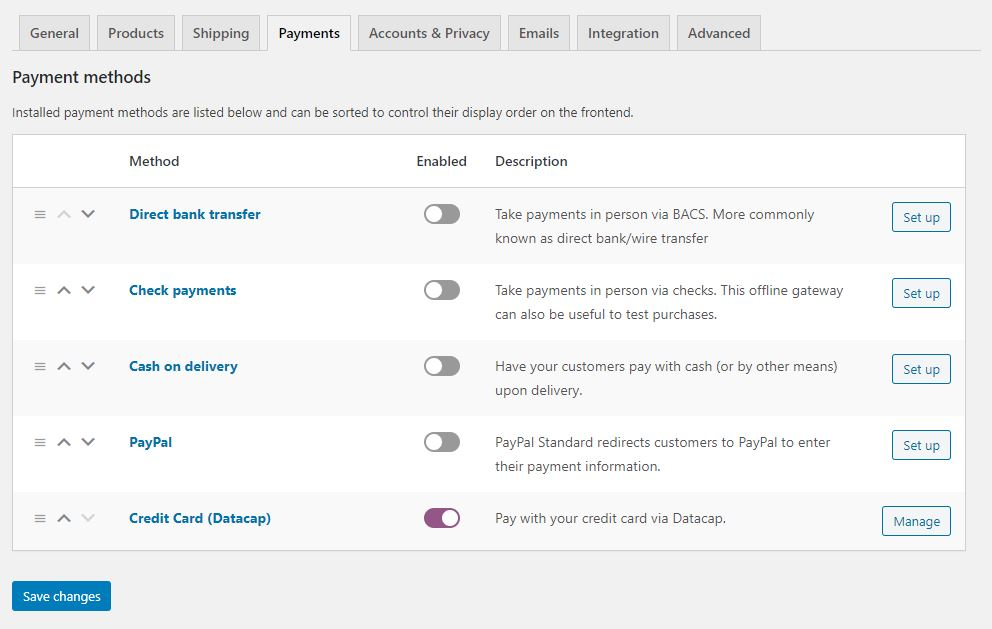
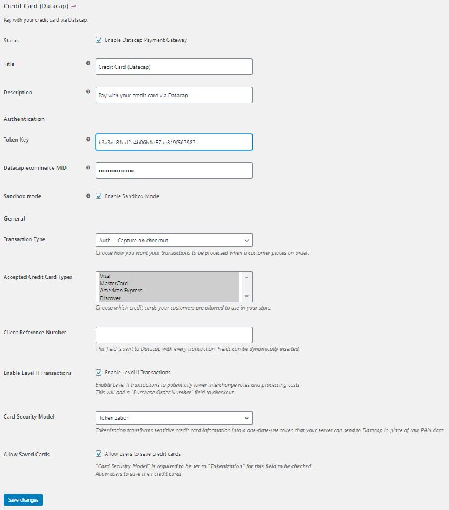

# WooCommerce

Datacap's WooCommerce plugin for WordPress

### 1. Download WooCommerce from the plugins section of your WordPress Dashboard and Activate it.

### 2. Download Datacap's plugin from the latest release. Choose the pre-bundled zip rather than the zip of the source files. Don't unzip the file.

[Datacap WooCommerce plugin Releases](https://github.com/datacapsystems/WooCommerce/releases)

### 3. Upload the plugin zip file from the WordPress plugins dashboard. Click the "Upload Plugin" and select the zip file.

### 4. Once the Datacap plugin is uploaded, go to "installed plugins" from the WordPress Dashboard and make sure the Datacap plugin is activated. Click "Activate". The plugin will be highlighted once activated.

### 5. Navigate to WooCommerce from the WordPress Dashboard and select "Settings". Click the "Payments" tab and make sure "Credit Card (Datacap)" is enabled.

### 6. Click "Manage" and enter the Token Key and eCommerce MID that you recieved from Datacap.

### 7. Edit other settings as needed and click "Save Changes"

## Report bugs

If you encounter any bugs or issues with the latest version of the Datacap WooCommerce plugin, please report them to us by opening a [GitHub Issue](https://github.com/datacapsystems/WooCommerce/issues)!